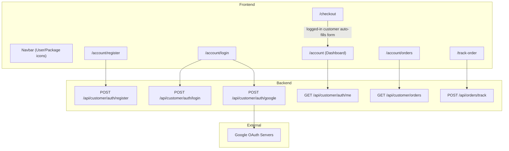
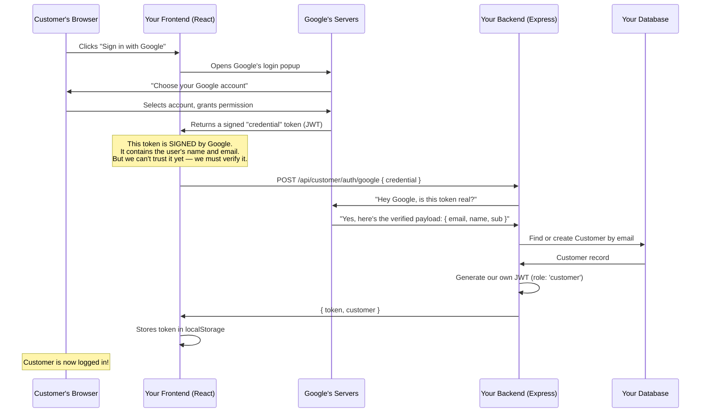

# Customer Authentication & Order Tracking — Full Documentation

This document covers everything about the Customer Login, Google OAuth, and Order Tracking system built for Mayura Heritage Crafts. It explains **what** was built, **how** it works under the hood, and includes a complete guide for setting up Google OAuth from scratch.

---

## Table of Contents

1. [Architecture Overview](#architecture-overview)
2. [How Google OAuth Works](#how-google-oauth-works)
3. [Setting Up Google OAuth (Step-by-Step)](#setting-up-google-oauth-step-by-step)
4. [Backend Changes](#backend-changes)
5. [Frontend Changes](#frontend-changes)
6. [Environment Variables](#environment-variables)
7. [API Reference](#api-reference)
8. [User Flows](#user-flows)

---

## Architecture Overview

The system uses a **separated auth model** — Admin users and Customers have completely different database tables, middleware, and login flows. This keeps the admin panel secure and isolated from the customer-facing portal.



### Key Design Decisions

| Decision | Reasoning |
|---|---|
| Separate `Customer` model (not reusing `User`) | Admin auth stays isolated; customer-specific fields (addresses, Google ID) don't pollute the admin schema |
| `customerId` on `Order` is **optional** | Guest checkout continues to work — customers don't need an account to buy |
| Google Client Secret only on **backend** | Frontend code is visible to anyone; secrets must never be exposed in the browser |
| JWT with `role: 'customer'` | The middleware checks the role field, so a customer token can never access admin routes and vice versa |

---

## How Google OAuth Works

Here's the complete flow, explained simply:



### Why do we need both a Client ID and a Client Secret?

| Credential | Where it lives | Purpose |
|---|---|---|
| **Client ID** | Frontend `.env` + Backend `.env` | A public identifier. It tells Google *which application* is requesting the login. It's safe to expose — it's like a username. |
| **Client Secret** | Backend `.env` **only** | A private key. The backend uses it (via `google-auth-library`) to cryptographically verify that the token Google sent is authentic and hasn't been tampered with. It's like a password — **never put this in frontend code**. |

---

## Setting Up Google OAuth (Step-by-Step)

> [!IMPORTANT]
> Google OAuth is **completely free**. Google does not charge anything for using their OAuth service, regardless of how many users sign in. There is no paid tier or usage limit for basic authentication.

### Step 1: Go to Google Cloud Console

1. Open your browser and go to **[https://console.cloud.google.com](https://console.cloud.google.com)**
2. Sign in with your Google account (any Gmail works)

### Step 2: Create a New Project

1. Click the **project dropdown** at the top-left of the page (next to "Google Cloud")
2. Click **"New Project"** in the top-right of the popup
3. Enter a name like `Mayura Heritage Crafts`
4. Click **"Create"**
5. Wait a few seconds, then select the new project from the dropdown

### Step 3: Configure the OAuth Consent Screen

This is the screen your customers see when they click "Sign in with Google."

1. In the left sidebar, navigate to **APIs & Services → OAuth consent screen**
2. Click **"Get Started"** or **"Configure Consent Screen"**
3. Fill in the fields:
   - **App name:** `Mayura Heritage Crafts`
   - **User support email:** Your email address
   - **Developer contact email:** Your email address
4. For **Audience**, select **"External"** (so any Google user can log in)
5. Click **"Save and Continue"** through the remaining steps (Scopes, Test Users, etc.) — the defaults are fine
6. Click **"Publish App"** when prompted (to move out of "Testing" mode)

> [!NOTE]
> While in "Testing" mode, only email addresses you manually add as "Test Users" can log in. Publishing the app removes this restriction. Google may show a review warning, but for basic login (email + profile), no review is actually required.

### Step 4: Create OAuth Credentials

1. In the left sidebar, go to **APIs & Services → Credentials**
2. Click **"+ Create Credentials"** → **"OAuth client ID"**
3. For **Application type**, select **"Web application"**
4. Give it a name like `Mayura Web Client`
5. Under **"Authorized JavaScript origins"**, add:
   - `http://localhost:8080` (for local development)
   - `https://yourdomain.com` (for production — add this later)
6. Under **"Authorized redirect URIs"**, add:
   - `http://localhost:8080` (for local development)
   - `https://yourdomain.com` (for production — add this later)
7. Click **"Create"**

### Step 5: Copy Your Credentials

After creating, Google will show you a popup with two values:

| Field | Example Value | Where to put it |
|---|---|---|
| **Client ID** | `368134409375-xxxxx.apps.googleusercontent.com` | `frontend/.env` as `VITE_GOOGLE_CLIENT_ID` AND `backend/.env` as `GOOGLE_CLIENT_ID` |
| **Client Secret** | `GOCSPX-xxxxxxxxxxxxx` | `backend/.env` as `GOOGLE_CLIENT_SECRET` **only** |

### Step 6: Add to Your `.env` Files

**`frontend/.env`:**
```env
VITE_GOOGLE_CLIENT_ID="368134409375-xxxxx.apps.googleusercontent.com"
```

**`backend/.env`:**
```env
GOOGLE_CLIENT_ID="368134409375-xxxxx.apps.googleusercontent.com"
GOOGLE_CLIENT_SECRET="GOCSPX-xxxxxxxxxxxxx"
```

### Step 7: Restart Your Servers

After changing `.env` files, you **must** restart both servers:
```bash
# Terminal 1 — Backend
cd backend
# Press Ctrl+C to stop, then:
npm run dev

# Terminal 2 — Frontend
cd frontend
# Press Ctrl+C to stop, then:
npm run dev
```

> [!TIP]
> When deploying to production, remember to add your production domain (e.g., `https://mayuraheritage.com`) to the **Authorized JavaScript origins** and **Authorized redirect URIs** in Google Cloud Console.

---

## Backend Changes

### Database Schema

Two key changes were made to `backend/prisma/schema.prisma`:

**New `Customer` model:**
```prisma
model Customer {
  id            String   @id @default(uuid())
  email         String   @unique
  name          String
  passwordHash  String?          // null for Google-only users
  googleId      String?  @unique // null for email/password-only users
  phone         String?
  addressLine1  String?
  addressLine2  String?
  city          String?
  state         String?
  postalCode    String?
  country       String?
  orders        Order[]
  createdAt     DateTime @default(now())
  updatedAt     DateTime @updatedAt
}
```

**Updated `Order` model** (added optional customer link):
```prisma
model Order {
  // ... existing fields ...
  customerId    String?
  customer      Customer? @relation(fields: [customerId], references: [id])
}
```

### New Files Created

| File | Purpose |
|---|---|
| [customer-auth.ts](file:///c:/Users/iarul/Documents/Project/mayura-heritage-crafts/backend/src/routes/customer-auth.ts) | Registration, Login, Google OAuth, and Profile (`/me`) routes |
| [customer-orders.ts](file:///c:/Users/iarul/Documents/Project/mayura-heritage-crafts/backend/src/routes/customer-orders.ts) | Fetch customer's own order history |

### Modified Files

| File | What Changed |
|---|---|
| [auth.ts](file:///c:/Users/iarul/Documents/Project/mayura-heritage-crafts/backend/src/middleware/auth.ts) | Added `customerAuthMiddleware` (enforces `role: 'customer'`) and `optionalAuthMiddleware` (attaches user info if token present, but doesn't block) |
| [orders.ts](file:///c:/Users/iarul/Documents/Project/mayura-heritage-crafts/backend/src/routes/orders.ts) | Uses `optionalAuthMiddleware` on `POST /` to link orders to logged-in customers; Added `POST /track` for public order lookup |
| [index.ts](file:///c:/Users/iarul/Documents/Project/mayura-heritage-crafts/backend/src/index.ts) | Registered new routes: `/api/customer/auth` and `/api/customer/orders` |

### Dependencies Installed

```bash
# In the backend directory
npm install bcrypt google-auth-library
npm install --save-dev @types/bcrypt
```

- **`bcrypt`** — Securely hashes passwords (never stored in plain text)
- **`google-auth-library`** — Google's official library for verifying OAuth tokens
- **`@types/bcrypt`** — TypeScript type definitions for bcrypt

---

## Frontend Changes

### New Files Created

| File | Purpose |
|---|---|
| [CustomerAuthContext.tsx](file:///c:/Users/iarul/Documents/Project/mayura-heritage-crafts/frontend/src/context/CustomerAuthContext.tsx) | React Context that manages customer login state across the app. Stores/retrieves JWT from `localStorage` under the key `customer_token`. |
| [CustomerLogin.tsx](file:///c:/Users/iarul/Documents/Project/mayura-heritage-crafts/frontend/src/pages/customer/CustomerLogin.tsx) | Login page with Google button + email/password form |
| [CustomerRegister.tsx](file:///c:/Users/iarul/Documents/Project/mayura-heritage-crafts/frontend/src/pages/customer/CustomerRegister.tsx) | Registration page with name, email, password fields |
| [CustomerDashboard.tsx](file:///c:/Users/iarul/Documents/Project/mayura-heritage-crafts/frontend/src/pages/customer/CustomerDashboard.tsx) | Dashboard showing profile details and quick links |
| [CustomerOrders.tsx](file:///c:/Users/iarul/Documents/Project/mayura-heritage-crafts/frontend/src/pages/customer/CustomerOrders.tsx) | Lists all orders placed by the logged-in customer |
| [TrackOrder.tsx](file:///c:/Users/iarul/Documents/Project/mayura-heritage-crafts/frontend/src/pages/TrackOrder.tsx) | Public page — anyone can track an order with order number + email |

### Modified Files

| File | What Changed |
|---|---|
| [App.tsx](file:///c:/Users/iarul/Documents/Project/mayura-heritage-crafts/frontend/src/App.tsx) | Wrapped app in `GoogleOAuthProvider` and `CustomerAuthProvider`; Added routes for `/account/*` and `/track-order` |
| [Navbar.tsx](file:///c:/Users/iarul/Documents/Project/mayura-heritage-crafts/frontend/src/components/Navbar.tsx) | Added User icon (links to account/login) and Package icon (links to order tracking) |
| [Checkout.tsx](file:///c:/Users/iarul/Documents/Project/mayura-heritage-crafts/frontend/src/pages/Checkout.tsx) | Auto-fills customer name, email, phone, and address if logged in |
| [api.ts](file:///c:/Users/iarul/Documents/Project/mayura-heritage-crafts/frontend/src/lib/api.ts) | Exported `api` object with `baseUrl` for use in customer components |

### Dependencies Installed

```bash
# In the frontend directory (or root if using workspaces)
npm install @react-oauth/google
```

- **`@react-oauth/google`** — Google's official React component that renders the "Sign in with Google" button and handles the popup flow

---

## Environment Variables

### Frontend (`frontend/.env`)

| Variable | Description | Example |
|---|---|---|
| `VITE_GOOGLE_CLIENT_ID` | Public Google OAuth Client ID | `368134409375-xxxx.apps.googleusercontent.com` |
| `VITE_API_URL` | Backend API base URL (already existed) | `http://localhost:5000/api` |

### Backend (`backend/.env`)

| Variable | Description | Example |
|---|---|---|
| `GOOGLE_CLIENT_ID` | Google OAuth Client ID (same value as frontend) | `368134409375-xxxx.apps.googleusercontent.com` |
| `GOOGLE_CLIENT_SECRET` | Google OAuth Client Secret (**backend only!**) | `GOCSPX-xxxxxxxxxxxxx` |
| `JWT_SECRET` | Secret used to sign JWTs (already existed) | `mayura-heritage-super-secret-key-2026` |
| `JWT_EXPIRES_IN` | Token expiry duration (already existed) | `7d` |

> [!CAUTION]
> Never commit `.env` files to Git. They contain secrets. Make sure `.env` is listed in your `.gitignore` file.

---

## API Reference

### Customer Authentication

| Method | Endpoint | Auth Required | Description |
|---|---|---|---|
| `POST` | `/api/customer/auth/register` | No | Create a new customer account with email/password |
| `POST` | `/api/customer/auth/login` | No | Login with email/password, returns JWT |
| `POST` | `/api/customer/auth/google` | No | Login/register via Google token, returns JWT |
| `GET` | `/api/customer/auth/me` | Yes (`customer_token`) | Get the logged-in customer's profile |

### Customer Orders

| Method | Endpoint | Auth Required | Description |
|---|---|---|---|
| `GET` | `/api/customer/orders` | Yes (`customer_token`) | List all orders for the logged-in customer |
| `GET` | `/api/customer/orders/:id` | Yes (`customer_token`) | Get details of a specific order |

### Public Tracking

| Method | Endpoint | Auth Required | Description |
|---|---|---|---|
| `POST` | `/api/orders/track` | No | Track any order by order number + email |

---

## User Flows

### Flow 1: New Customer Registers with Email

1. Customer clicks the **User icon** in the Navbar
2. Arrives at `/account/login`, clicks **"Register here"**
3. Fills in Name, Email, Password on `/account/register`
4. Backend hashes the password with `bcrypt`, creates the `Customer` record, returns a JWT
5. Frontend stores the JWT in `localStorage` as `customer_token`
6. Customer is redirected to `/account` (Dashboard)

### Flow 2: Customer Logs in with Google

1. Customer clicks the **User icon** → arrives at `/account/login`
2. Clicks the **"Sign in with Google"** button
3. Google popup appears → customer selects their Google account
4. Google returns a signed credential to the frontend
5. Frontend sends this credential to `POST /api/customer/auth/google`
6. Backend verifies the token with Google's servers using `google-auth-library`
7. If the email already exists in the `Customer` table, the `googleId` is linked to that account
8. If the email is new, a new `Customer` record is created automatically
9. Backend returns our own JWT → customer is logged in

### Flow 3: Guest Tracks an Order

1. Anyone clicks the **Package icon** in the Navbar
2. Arrives at `/track-order`
3. Enters their **Order Number** (e.g., `MHC-260428-A1B2C`) and the **email** they used during checkout
4. Backend looks up the order and verifies the email matches
5. Order details (status, tracking number, items) are displayed

### Flow 4: Logged-in Customer Checks Out

1. Customer adds items to cart and proceeds to `/checkout`
2. Because they're logged in, the checkout form **auto-fills** their name, email, phone, and address
3. Order is created with `customerId` linked to their account
4. After payment, the order appears in their `/account/orders` page

---

> [!TIP]
> **For Production Deployment**, remember to:
> 1. Add your production domain to Google Cloud Console (Authorized Origins + Redirect URIs)
> 2. Update `frontend/.env` with the production API URL
> 3. Switch Razorpay from test keys to live keys
> 4. Use a strong, unique `JWT_SECRET`
